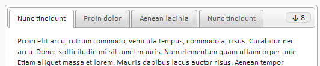

# OverflowTabs
Extends jQuery UI Tabs to group together tabs that don't fit into an 'overflow' drop down list.

Works with jQuery 1.9+ (Last tested version: 2.1.3)

Works in latest Chrome, FireFix and IE 9+

### What is this?

This plugin will automatically detect the available space in a tabs container
and then determine if all of the tabs will fit, any tab that cannot fit in the
container on a single row will be grouped together in an 'overflow' drop down.
 
The tabs are automatically updated when the page resizes and can be updated manually
by running:

	$("#tabs").tabs("refresh");

Initialising the overflow tabs can be done by simply adding an extra option
when loading the jQuery ui tabs:

	var tabs = $('#tabs').tabs({
		overflowTabs: true
	});

### JSFiddle

This was originally created in May 2014 to meet the needs of a project I was working on at the time. Since then I have modified very little. The plugin was made available on [JSFiddle](http://jsfiddle.net/boreded/2JK7K/10/) and submitted as answer on this [stackoverflow question](http://stackoverflow.com/a/23802234/1290196).

### Disclaimer

This will contain bugs. If you find one, it would be great if you could fix it and send a pull request.

### License

Released under the MIT license.